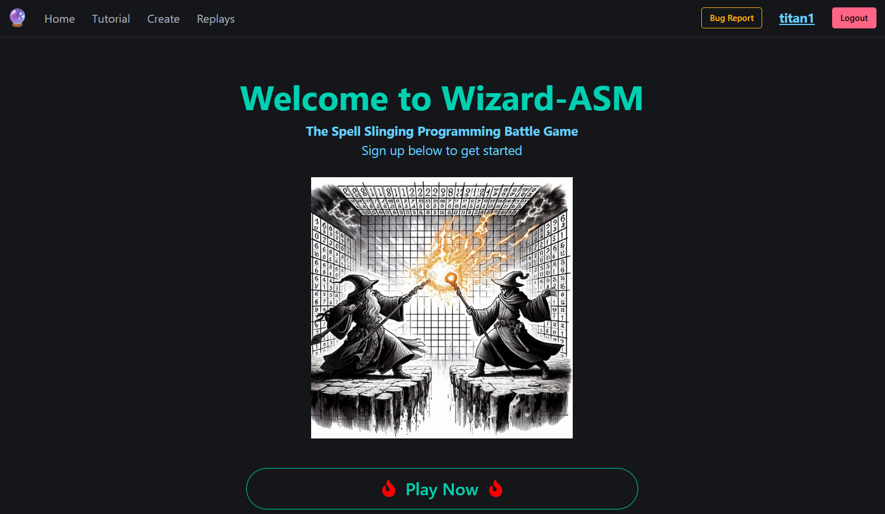

# Wizard-ASM

In Wizard-ASM, players build a simple program using 'wizard-asm-language' (an assembly language inspired set of instructions) which they will use to go head to head with other players in 1v1 duels.

I wanted to make a game that people could play and have fun while learning to think more like a programmer.

The game instructions allow players to move, teleport, summon fire and lightning, create shields, etc.

Build a program, much like you would using a real programming language, and see if you come out on top. 

Play it today: [https://wizard.nadabyte.net](https://wizard.nadabyte.net)

## Technical Details

#### Wizard-ASM is built with:

__Frontend__
* HTML
* Javascript + vue.js
* CSS + Bulma

__Backend__
* GO
* MongoDB
